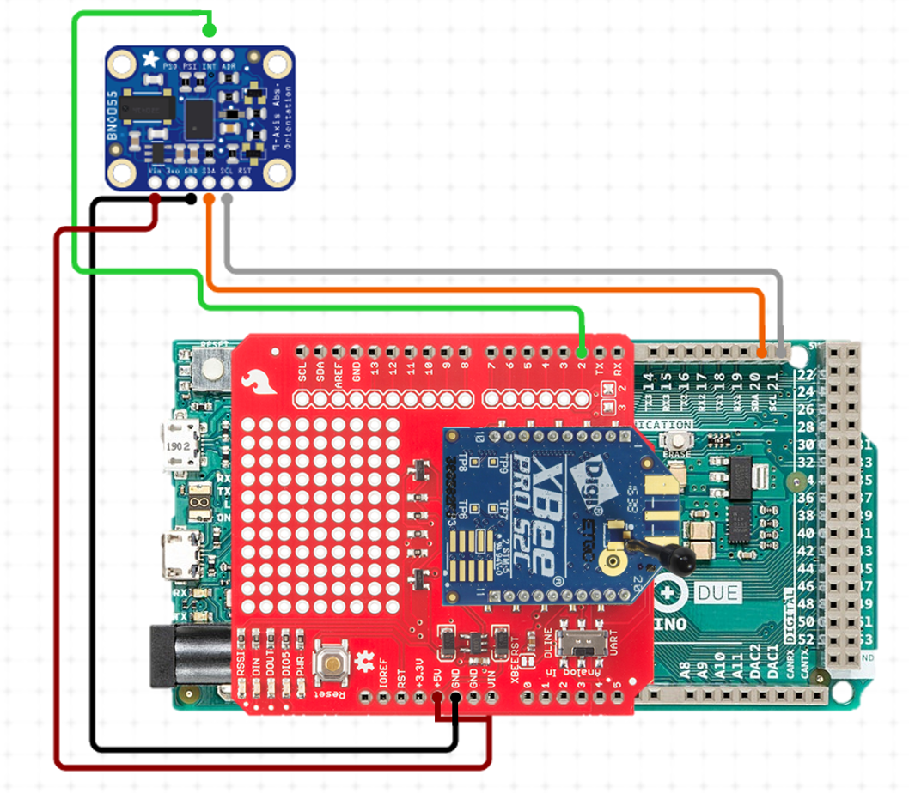

# NASA-USLI-2021

## Challenge

Teams shall design a payload capable of autonomously locating the launch vehicle upon landing by identifying the launch vehicle’s grid position on an aerial image of the
launch site without the use of a global positioning system (GPS). The method(s)/design(s) utilized to complete the payload mission will be at the teams’ discretion and will be permitted so long as the
designs are deemed safe, obey FAA and legal requirements, and adhere to the intent of the challenge.

## Requirements

* The payload will be capable of remaining in launch-ready configuration on the pad for a minimum of 2 hours without losing the functionality of any critical on-board components, although
the capability to withstand longer delays is highly encouraged.

* GPS shall not be used to aid in any part of the payload mission.
  * GPS coordinates of the launch vehicles landing location shall be known and used solely for the purpose of verification of payload functionality and mission success.

* No external hardware or software is permitted outside the team’s prep area or the launch vehicle itself prior to launch.

* Magnetometers and any data gathered by a magnetometer is an example of a similar technology that is prohibited due to not knowing if the generic planetary body we are simulating a landing on has a magnetic field.

## Solution

The payload will be capable of autonomously locating the launch vehicle upon landing and identify its grid position on an aerial image of the launch field (with the dimension of each grid box equal to or less than 250 feet by 250 feet) without the use of a global positioning system (GPS). The payload will consist of an Inertial Navigation System (INS), radio and a power source. Using the measurements from the onboard sensor the payload will compute its relative position to the launch site. There will be a constant downlink of the data via the radio to the ground station. The criterion for success is defined by accurate calculation of the launch vehicles current position within the range of the launch field (2500 feet in every direction), downlink of telemetry data and safe recovery of payload.

## Circuit Diagram

Components                 |  Circuit
:-------------------------:|:-------------------------:
 |  

## Getting Started

- Download the [Arduino IDE 2.0](https://www.arduino.cc/en/software)
- (In the Arduino IDE) Sketch > Include Library > Manage Libraries
- Install `Adafruit Unified Sensor by Adafruit` and `Adafruit BNO055 by Adafruit`

## Adafruit BNO055

The sensor comprises of an accelerometer, gyroscope and magnetometer. The sensor fusion modes are meant to calculate measures describing the orientation of the device in space.
Since, the use of magnetometer is prohibited the absolute orientation or orientation of the sensor with respect to the earth and its magnetic field is unknown. The operation mode selected will ensure the magnetometer is suspended. The non-absolute or relative orientation calculated will be with respect to the sensor's orientation and position before launch.

### Operation Modes

- Config Mode: This mode is used to configure BNO, wherein all output data is reset to zero and sensor fusion is halted. This is the only mode in which all the writable register map entries can be changed.
- IMU Mode: In the IMU mode the relative orientation of the BNO055 in space is calculated from the accelerometer and gyroscope data.

## XBee Shield

To select between software and hardware serial, the XBee Shield includes a small, surface-mount slide switch. This switch allows you to select between the hardware serial port (UART position) and a software serial port connected to pins 2 (Arduino-side RX) and 3 (Arduino-side TX). 

***Make sure the switch is in the "DLINE" position when uploading sketches***

## Configuring Networks

In order to transmit data wirelessly between your XBees, set the DH and DL parameters on each module to match the SH and SL (SH + SL = MAC address) of the other module. For example, if the MAC of XBee A is 0013A20012345678, then the DH of XBee B should be 0013A200 and the DL 12345678.

| Parameter | XBEE A   | XBEE B   | Effect                                                                          |
|-----------|----------|----------|---------------------------------------------------------------------------------|
| NI        | Ground   | Rocket   | The node identifier string for this module.                                     |
| ID        | 4B1D     | 4B1D     | The network ID. Only modules with matching IDs can communicate with each other. |
| DH        | 13A200   | 13A200   | The upper 32 bits of the 64 bit destination address.                            |
| DL        | 419309F1 | 41930582 | The lower 32 bits of the 64 bit destination address.                            |

## References

1. <https://cdn-shop.adafruit.com/datasheets/BST_BNO055_DS000_12.pdf> 
2. <https://learn.sparkfun.com/tutorials/xbee-shield-hookup-guide>
